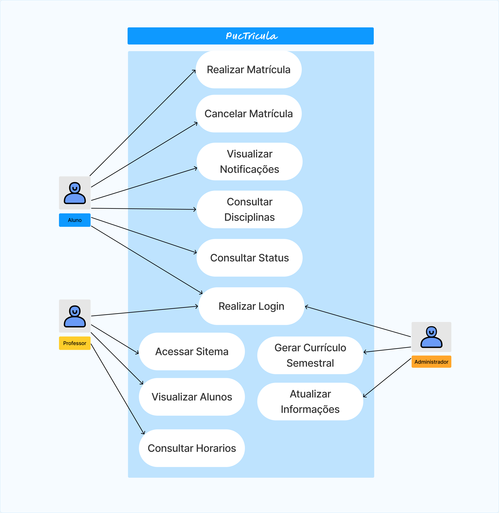

#

Este projeto tem como objetivo informatizar o sistema de matrículas de uma universidade, permitindo que alunos, professores e a secretaria da universidade possam gerenciar suas atividades acadêmicas de forma eficiente. O sistema abrange funcionalidades desde a geração de currículos até a consulta de alunos matriculados em disciplinas.

## Funcionalidades

### Secretaria da Universidade

- **Gerar Currículo:** Permite à secretaria da universidade gerar o currículo para cada semestre.
- **Manter Informações de Disciplinas:** Permite à secretaria atualizar as informações sobre as disciplinas oferecidas.
- **Manter Informações de Professores:** Permite à secretaria manter os dados dos professores atualizados.
- **Manter Informações de Alunos:** Permite à secretaria atualizar as informações sobre os alunos.

### Alunos

- **Matricular-se em Disciplinas:** Permite aos alunos se matricular nas disciplinas disponíveis para o semestre.
- **Cancelar Matrícula:** Permite aos alunos cancelar matrículas feitas anteriormente.
- **Consultar Disciplinas Disponíveis:** Permite aos alunos visualizar as disciplinas disponíveis para matrícula.
- **Verificar Horários das Disciplinas:** Permite aos alunos verificar os horários das disciplinas para planejar seu semestre.
- **Verificar Status da Matrícula:** Permite aos alunos verificar o status de suas matrículas.
- **Receber Notificações de Alterações:** Permite aos alunos receber notificações de alterações nas disciplinas matriculadas.

### Professores

- **Consultar Alunos Matriculados:** Permite aos professores visualizar os alunos matriculados em suas disciplinas.
- **Consultar Horários das Disciplinas:** Permite aos professores consultar os horários das disciplinas que lecionam.

### Sistema de Matrículas

- **Notificar Sistema de Cobranças:** O sistema de matrículas notifica o sistema de cobranças sobre as matrículas realizadas.
- **Validar Login:** Permite que todos os usuários do sistema façam login utilizando suas senhas.

## Tecnologias Utilizadas

- **Frontend:**
- **Backend:** 
- **Banco de Dados:** 

## Casos de Uso 

# Histórias de Usuário PUCTriculas

| **ID** | **Ator**             | **História de Usuário**                                                                                                                                           |
|--------|----------------------|-------------------------------------------------------------------------------------------------------------------------------------------------------------------|
| 1      | Secretaria           | Como secretaria da universidade, eu quero gerar o currículo para cada semestre, para que os alunos possam saber quais disciplinas estão disponíveis.                |
| 2      | Secretaria           | Como secretaria da universidade, eu quero manter as informações sobre as disciplinas, para que os alunos possam se matricular corretamente.                         |
| 3      | Secretaria           | Como secretaria da universidade, eu quero manter as informações sobre os professores, para que os alunos saibam quem são os docentes das disciplinas.                |
| 4      | Secretaria           | Como secretaria da universidade, eu quero manter as informações sobre os alunos, para que o sistema possa gerenciar as matrículas de forma eficiente.                |
| 5      | Aluno                | Como aluno, eu quero me matricular nas disciplinas disponíveis, para que eu possa cursar as matérias necessárias para minha formação.                                 |
| 6      | Aluno                | Como aluno, eu quero cancelar minha matrícula em disciplinas, para que eu possa ajustar meu cronograma de acordo com minhas necessidades.                            |
| 7      | Aluno                | Como aluno, eu quero consultar as disciplinas disponíveis para matrícula, para que eu possa planejar meu semestre.                                                   |
| 8      | Aluno                | Como aluno, eu quero verificar os horários das disciplinas, para que eu possa montar um horário que se encaixe com minhas outras atividades.                          |
| 9      | Aluno                | Como aluno, eu quero verificar o status das minhas matrículas, para que eu saiba se minhas matrículas foram confirmadas ou se há problemas.                           |
| 10     | Aluno                | Como aluno, eu quero receber notificações de alterações em minhas disciplinas, para que eu possa me manter informado sobre qualquer mudança que ocorra.              |
| 11     | Professor            | Como professor, eu quero acessar o sistema para saber quais alunos estão matriculados nas minhas disciplinas, para que eu possa planejar minhas aulas de acordo.    |
| 12     | Professor            | Como professor, eu quero consultar os horários das disciplinas que leciono, para que eu possa me organizar e preparar minhas aulas.                                    |
| 13     | Sistema de cobranças| Como sistema de cobranças, eu quero receber notificações do sistema de matrículas sobre as matrículas realizadas, para que eu possa gerar cobranças corretas para os alunos pelas disciplinas em que se matricularam.|
| 14     | Usuário | Como usuário do sistema, eu quero validar meu login utilizando minha senha, para que eu possa acessar minhas informações de forma segura.                             |

